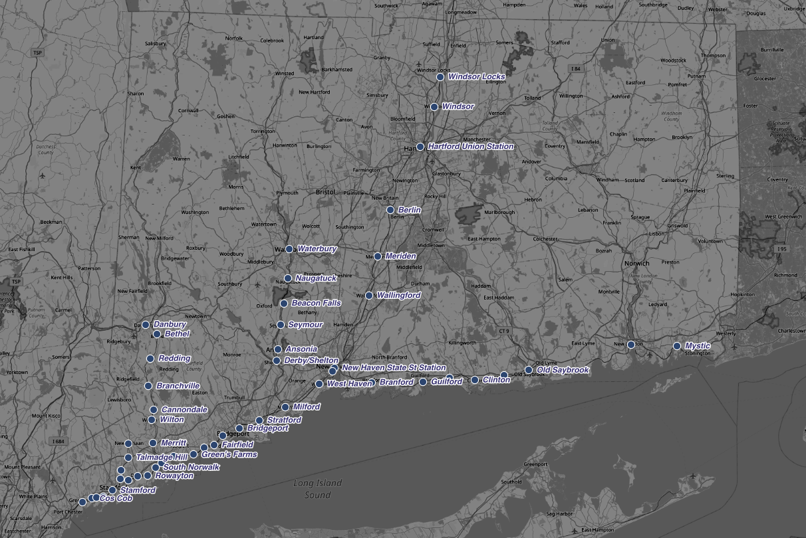

# Train station locations in Connecticut

This repository contains a list of 52 train stations in Connecticut, with their approximate latitude and longitude coordinates.

This list aims to be a comprehensive list for all stations, including those serving Amtrak, [Hartford Line](https://www.hartfordline.com/route_stations/), [Metro North](http://web.mta.info/mnr/html/mnrmap.htm), and [Shore Line East](https://shorelineeast.com/).

## CSV vs JSON
Both `stations.json` and `stations.csv` contain the same information, just in different formats. CSV file was converted to JSON file using [csvjson.com website](https://csvjson.com/csv2json).

## Data Source

The major chunk of this dataset was taken from [CT Travel Smart](https://cttravelsmart.org/) website (specifically from [this endpoint](https://cttravelsmart.org/map/mapIcons/TrainStations)). Some locations were manually edited to be more precise (according to Google Maps). Station names were added manually.

## License
Feel free to use for any commercial or non-commercial project under the MIT license.